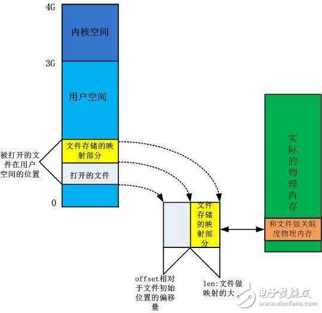

# ring-buffer
- **1.**  
  最终参考下面通过时间 构造测试数据，首先测试kfifo性能
  http://www.cnblogs.com/Anker/p/3481373.html

- **2.**  
结合mmap函数，将mmap出来的数据当做测试数据，来测试kfifo的性能
注意mmap对应块设备如磁盘 USB等，但是不能对应流设备如串口等
另外参数length的长度必须是4096 的整数倍  

  > doc link :  
[ [经验] 字符设备驱动另一种写法—mmap方法操作LED ](http://bbs.elecfans.com/jishu_1507715_1_1.html)  
[ [生活与情感] 资深嵌入式工程师分享职场必知9条军规 ](http://bbs.elecfans.com/jishu_1567987_1_1.html)

- **3.**  
一个内核中标准的mmap例子 kernel_imx/drivers/char/mxc_iim.c
目前已通过helper目录下测试代码，测试mmap的使用，并使用内存设备直接代替具体的物理设备如dongle等。
下面就可以通过把helper的代码集成到test.c中就可以完全实现kfifo与mmap的综合应用了

### 未解决问题：###
- 1.  为什么要用环形缓冲区kfifo
- 2.  内核数据写入，与mmap后的用户空间取走这个buffer的数据如何同步
- 3.  内核模块的地址如何在用户空间操作

### 《针对上面的问题，如下思考》###
经过x86测试，得知写入数据大于ringbuffer给出的最大尺寸4096后，剩余的数据虽然走kfifo_put方法，但是数据并没有写入或者覆盖掉起始处的buffer，导致数据丢失，
所有后续 需要针对这个问题进行判断：如果缓冲区满了就等待，当读者将数据取走腾出空间了，写者再写入。这样写线程可以让出cpu，让他在这个等待间隙做其它的事情。
当然我的测试方法是写者很快，而读者很慢的情景

### 测试：###
需要针对helper中的生产者消费者 模型熟练掌握以后，在将kfifo的项目代码改编成包含这种模式的，目的是解决上面的问题 《针对上面的问题，如下思考》。
